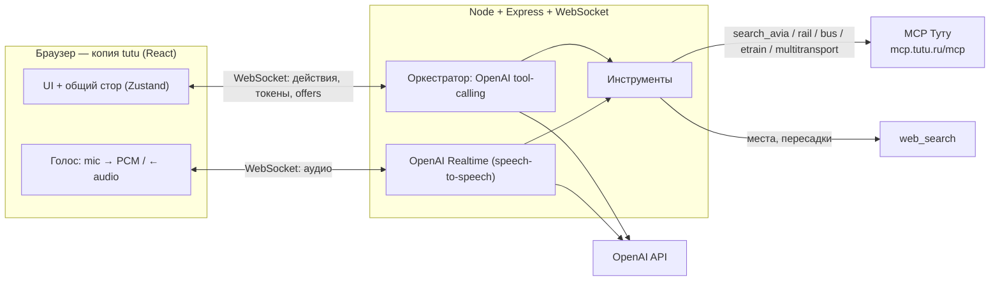
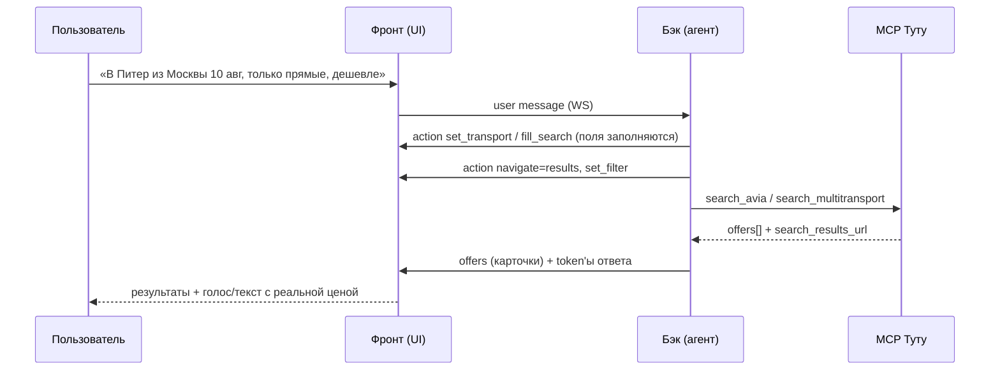

# tutu × AI-ассистент путешествий

Копия сайта **tutu.ru** с встроенным ИИ-ассистентом (текст + **голос через OpenAI Realtime**),
который сам заполняет форму поиска, переключает страницы, применяет фильтры и подбирает
**реальные** билеты через MCP-сервер Туту, планирует пересадки и рассказывает о местах из интернета.

---

## Ключевая идея

Ассистент не «печатает за пользователя» и не выдумывает данные. Он:

1. **Управляет интерфейсом** сайта — шлёт во фронт действия (`set_transport`, `fill_search`,
   `set_filter`, `navigate`). Пользователь видит, как поля заполняются, страница переключается,
   фильтры применяются.
2. **Ищет реальные данные** через живой MCP Туту (`mcp.tutu.ru/mcp`). Цены, рейсы, время — только оттуда.
3. **Доводит до оформления** — каждое предложение несёт реальный `search_results_url` (deep-link на tutu).
   MCP read-only, поэтому воронка заканчивается на странице оформления.
4. **Планирует пересадки** — считает время стыковки и предлагает, чем занять его (веб-поиск).
5. **Рассказывает о местах** — веб-поиск через OpenAI `web_search`.

---

## Архитектура



Текстовый и голосовой каналы делят **один и тот же набор инструментов** — вся бизнес-логика
и вызовы MCP живут на бэке.

### Поток одного запроса (текст)



---

## Инструменты MCP Туту (реальные, read-only)

| Инструмент | Назначение |
|---|---|
| `search_avia` | авиабилеты (origin/destination, IATA, direct_only, sort, price_max) |
| `search_rail` | ЖД (РЖД), реальные станции отправления/прибытия |
| `search_bus` | межгород автобусы |
| `search_etrain` | электрички |
| `search_multitransport` | мультимодальный «как добраться» (авиа+жд+автобус+электричка), `optimize_for` |
| `get_offer_details` | детали предложения |
| `get_rail_seatmap` | схема мест в вагоне |
| `create_checkout_link` | ссылка на оформление |

`sort` принимает `price_asc` / `price_desc` / `duration_asc` / `departure_asc`.

Наши инструменты для модели: `set_transport`, `fill_search`, `set_filter`, `search_offers`
(`transport: avia/zhd/bus/suburban/multi`), `web_places`.

---

## Стек

```
frontend/   React + Vite + Tailwind v4 + Zustand        (:5173)
backend/    Node + Express + ws + OpenAI + MCP SDK       (:8787)
```

## Запуск

```bash
# 1) бэкенд
cd backend
cp .env.example .env          # впишите OPENAI_API_KEY
npm install
npm run dev                   # :8787

# 2) фронтенд
cd ../frontend
npm install
npm run dev                   # :5173 (проксирует /api и /ws на бэк)
```

Откройте http://localhost:5173

## Сценарии для демо

1. **Прямой поиск** — «Покажи самолёты Москва — Питер на 10-е» → форма заполняется, результаты, deep-link.
2. **Оптимизация** — «Максимально дёшево до Казани, можно с пересадкой» → `search_multitransport`, сортировка по цене.
3. **Пересадка** — вариант с пересадкой ≥ 90 мин → ассистент сам предлагает, чем занять время в городе пересадки.
4. **Голос** — кнопка микрофона: разговор через OpenAI Realtime, ассистент отвечает голосом и управляет сайтом.

## Переменные окружения (`backend/.env`)

| Переменная | Описание |
|---|---|
| `OPENAI_API_KEY` | ключ OpenAI (tool-calling + Realtime + web_search) |
| `OPENAI_MODEL` | модель для текста, по умолчанию `gpt-4o` |
| `OPENAI_REALTIME_MODEL` | модель голоса, по умолчанию `gpt-realtime` |
| `OPENAI_REALTIME_VOICE` | голос Realtime, по умолчанию `alloy` |
| `TUTU_MCP_URL` | `https://mcp.tutu.ru/mcp` |
| `PORT` | порт бэка, по умолчанию `8787` |

> ⚠️ **Безопасность.** `backend/.env` с ключом в репозиторий не попадает — он в `.gitignore`.
> Для запуска скопируйте `backend/.env.example` → `backend/.env` и впишите свой `OPENAI_API_KEY`.

## Примечания

- **Голосовой режим** оформлен в стиле Apple «Liquid Glass» (прозрачная стеклянная панель
  с преломлением). SVG-преломление в `backdrop-filter` работает в Chromium (Chrome/Edge/Arc);
  в Safari/Firefox — корректный фолбэк на матовое стекло.
- Эхоподавление голоса: клиентский шумовой гейт + серверный VAD, чтобы ассистент не перебивал
  сам себя и не «выдумывал» речь из фонового шума.

## Лицензия

[MIT](LICENSE)
